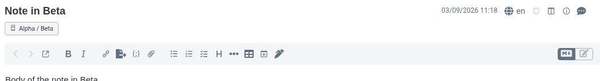
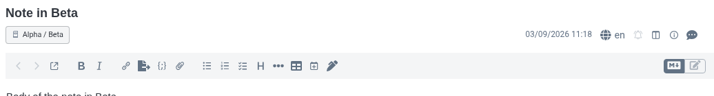
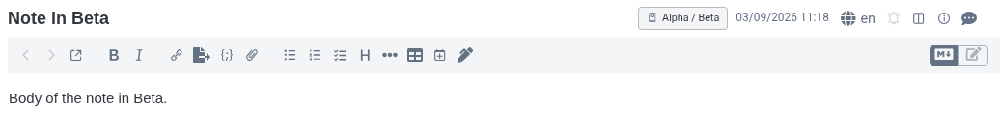
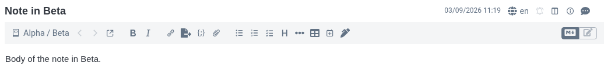

# Whereabouts

**Always know which notebook the note you are reading lives in.**

Joplin already tells you — but only sometimes. Open a note from a search result, a tag, or "All
notes" and a blue **In: \<Notebook\>** button appears under the title. Open the same note from its own
notebook and that button is gone, because in that view Joplin assumes you already know where you
are. You often don't: the sidebar scrolls, notebooks nest, and a note reached by an internal link,
the back button, or a second window arrives with no context at all.

Whereabouts shows the notebook **all the time**, in the same place, and makes it do something when
you click it.

### Own row below the title (default)

### Own row below the title, with the title-row icons moved down

The title gets the full width; the date and the note-toolbar icons drop onto the chip's row.

### Right of the title

### First item of the editor toolbar

*(These are captured from the running app by the end-to-end suite, so they always show the current
build.)*

In every placement the chip sits on Joplin's own vertical rhythm: the blank space above the chip's
row and the blank space below it are equal, and both match the gap a normal single-line title leaves
before the editor toolbar — so the chip reads as one more line of the editor, not as a banner.

## What it does

- Puts a small notebook chip in the note title area, on every note, in every view.
- Shows either just the notebook (**Beta**) or the whole path (**Alpha / Beta**).
- **Left click** — select that notebook in the sidebar, keeping the note you are reading open. This
  is exactly what Joplin's own pill does; it does not jump you to some other note.
- **Double click** — reveal the note in the note list (and focus it there).
- **Right click** — open Joplin's "Move to notebook" picker for this note.
- Optionally hides Joplin's own duplicate **In: \<Notebook\>** button.

If [Cockpit](https://github.com/pmslava/joplin-plugin-cockpit) is installed, a left click also
points its panel at the same notebook and a double click reveals the note there. Without Cockpit
nothing happens — the integration is fire-and-forget.

**A note on single vs double click today.** Both run the same Joplin action — select the notebook,
keep the note open — so right now the only difference you will see is that a double click *also*
moves focus onto the note's row in the list. They diverge properly once either Cockpit's
`revealNote` or core's `revealInNotebook` (PR laurent22/joplin#16354) exists; Whereabouts already
calls both and falls back silently while they don't.

## Settings

Found under **Tools → Options → Whereabouts**. All of them apply live; no restart.

| Setting | Default | What it does |
| --- | --- | --- |
| **What to show** | Notebook name only | `Notebook name only` shows `Beta`; `Full path` shows `Alpha / Beta`. |
| **Where to show it** | Own row below the title | Four options — see the screenshots above. *Own row below the title* uses the exact slot Joplin's own pill uses, aligned with the title text and the editor toolbar. *…with title-row icons moved down* additionally frees the whole title line for the title itself. *Right of the title* tucks the chip into the title row. *First item of the editor toolbar* puts it at the head of the formatting-button row, styled as a native toolbar button. |
| **Hide Joplin's own "In: \<Notebook\>" button** | On | Removes the duplicate blue button in search / tag / All-notes views. |
| **Path separator** | ` / ` | Placed between notebook names in full-path mode. |
| **Show the notebook icon** | On | The notebook glyph before the name. |

## Installing

From Joplin: **Tools → Options → Plugins**, search for *Whereabouts*.

Manually: download `io.github.pmslava.whereabouts.jpl` from the
[releases](https://github.com/pmslava/joplin-plugin-whereabouts/releases), then **Tools → Options →
Plugins → the gear icon → Install from file**, and restart Joplin.

## Limitations

These are structural, not bugs to be fixed later:

- **Desktop only.** On mobile the note title is a React Native field outside the editor's WebView,
  which is the only place a plugin's code can run. (Joplin mobile already has "Reveal in notebook"
  in the note's kebab menu.)
- **Markdown editor only** — including Split and Viewer-only layouts, all of which work. The **Rich
  Text (WYSIWYG) editor does not**: it is a different component with no CodeMirror instance, so no
  plugin JavaScript runs in that window at all and no chip can appear.
- **It depends on Joplin's internal DOM.** Joplin has no API that reaches the note title bar, so
  Whereabouts injects into the title bar directly. The selectors it uses are verified against
  **Joplin 3.7.x** (`app_min_version: "3.7"`). A future Joplin could rename or restructure the title
  bar and break the chip; if that happens the plugin fails visibly (no chip) rather than quietly
  corrupting anything.
- **In a secondary editor window** (Note → Open in new window) the chip shows that window's own
  notebook correctly, but it is not clickable: the sidebar and note list its actions drive live in
  the main window.
- **Conflict notes, notes in the trash, and notes in a read-only share** show their location but are
  likewise inert — filtering to, revealing in, or moving out of those would not do what you meant,
  and Joplin would reject the move.
- **Turning the plugin off does not remove the chip until you restart Joplin.** Joplin gives a
  plugin no unload hook for an already-mounted editor extension, and no way to drop a chrome
  stylesheet it has loaded, so the chip, its refresh poll and the native-pill hide rule all survive
  until the next launch.

## Development

See [DEVELOPMENT.md](DEVELOPMENT.md) for the build, install and end-to-end test loop.

## Licence

MIT — see [LICENSE](LICENSE).
